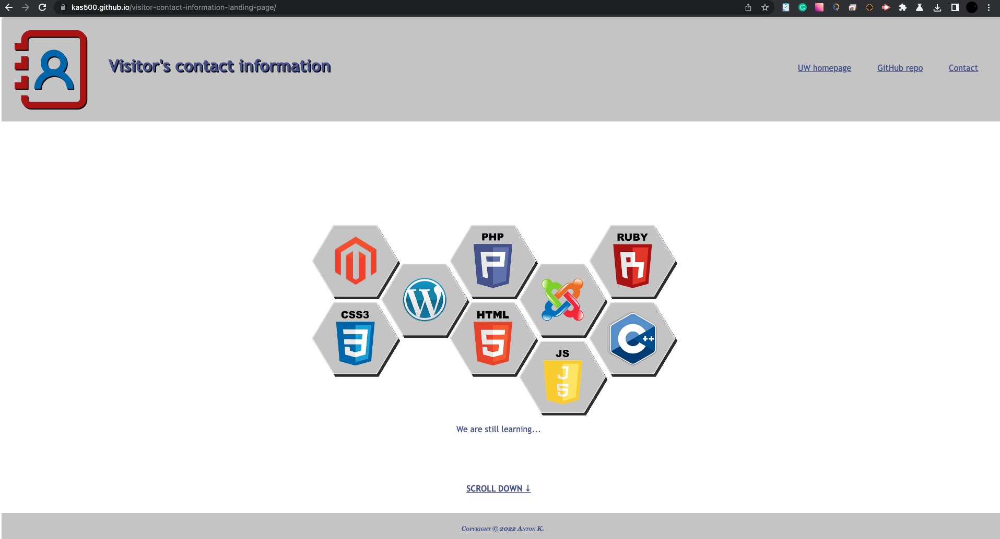
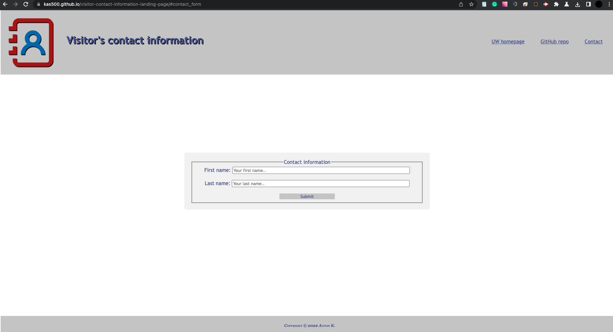

# Visitor's contact information. Activity 22

## Description

The Visitor's contact information landing page was created as part of Activity #22. In the process of building the application, knowledge was gained on how to manipulate the position of web interface elements using various CSS parameters, how to fix the header at the top of the page and the footer at the bottom of the page. The principles of working with form and figure were also studied.
## Installation

N/A

## Usage

The project was deployed using Github hosting and is available at the link https://kas500.github.io/visitor-contact-information-landing-page/

## Project web interface. Pic 1

## Project web interface. Pic 2

## Credits

N/A

## License

MIT License